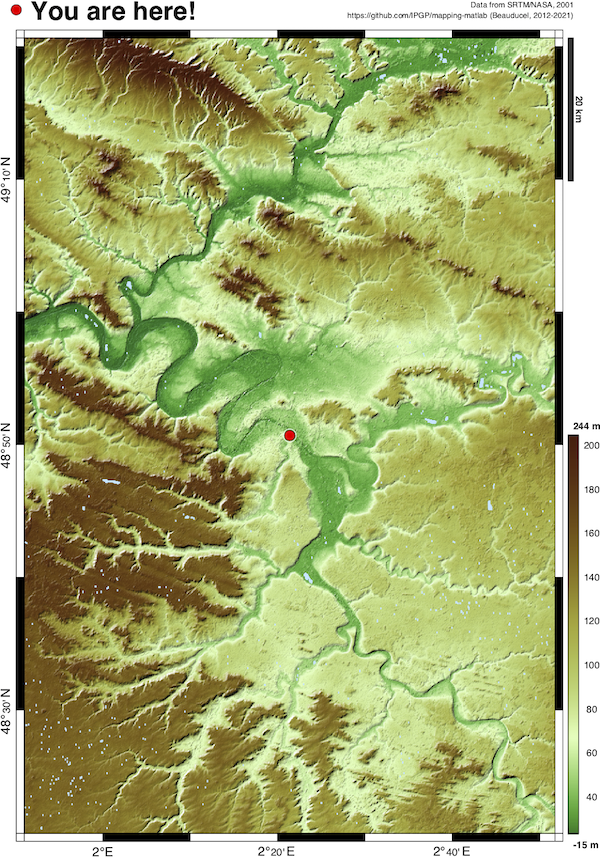
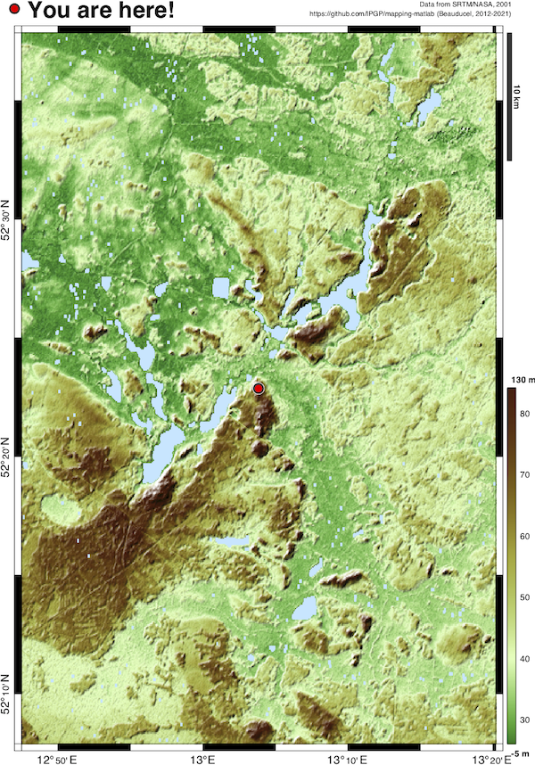

# Automatic geolocation map

## whereami.m

The function `whereami` tries to locate where your computer is and produces a map of illuminated relief topography as new figure, centered on	your position. `whereami(HOST)` allows to specify any host name or IP address. Other options are available (see examples below).

The function needs an internet connection, [READHGT and DEM](https://fr.mathworks.com/matlabcentral/fileexchange/36379-readhgt-import-download-nasa-srtm-data-files-hgt) functions, also available at https://github/IPGP/mapping-matlab.

### Installation
1. Download zip files from the two archives: [whereami](https://github.com/beaudu/whereami/archive/refs/heads/main.zip) and [readhgt](https://fr.mathworks.com/matlabcentral/fileexchange/36379-readhgt-import-download-nasa-srtm-data-files-hgt) (includes dem.m);
1. unzip and copy/move the following files in your working directory:
    - `whereami.m`
    - `readhgt.m`
    - `readhgt_srtm_index.txt`
    - `dem.m`
    - `landcolor.m`
1. under *Matlab* or *GNU Octave*, go to your working directory and type following examples at the command prompt.

### Examples
```matlab
% makes a figure centered on your present position on Earth
whereami
```

```matlab
% makes a figure centered on the IPGP institute in Paris, France.
whereami('www.ipgp.fr')
```



```matlab
% makes a figure centered on latitude/longitude 53.38°N / 13.06°E,
% which is the GFZ institute in Potsdam, Germany, with a 0.5° height.
whereami([53.38 13.06],0.5)
```



## Author
**François Beauducel**, [beaudu](https://github.com/beaudu), beauducel@ipgp.fr

## Documentation
Type `doc whereami` for help and syntax. See also []() users community comments.
